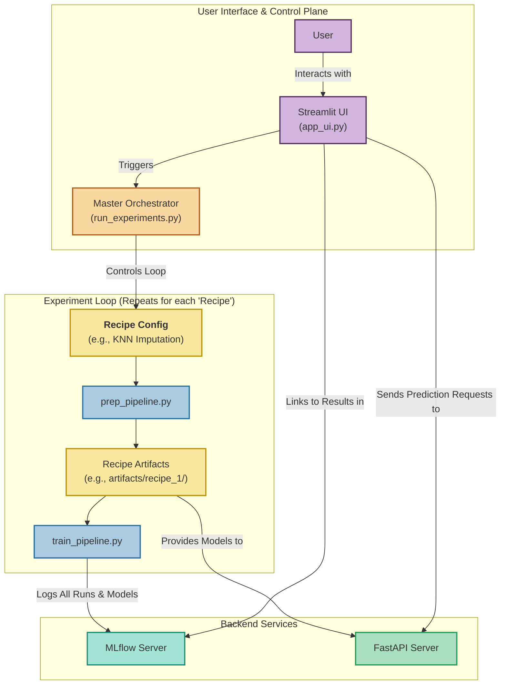

Of course, Yashu. Now that the project has a complete, stable architecture and a full suite of features, it's the perfect time to update the `README.md` file.

This document is crucial for explaining the project's value, architecture, and how to use it to Vinay or any new team members.

Here is a comprehensive, updated `README.md` content. You can copy and paste this directly into your `README.md` file.

---

# MLOps Model Garden & Experiment Platform

This project is a comprehensive, end-to-end MLOps platform designed to automate the machine learning lifecycle for various task types. It provides a robust framework for data validation, preprocessing, model training, hyperparameter optimization, experiment tracking, and model serving, all orchestrated through an interactive user interface.

## Key Features

* **Multi-Task AutoML:** Supports **Classification**, **Regression**, and **Clustering** tasks out-of-the-box with a "model garden" approach, training a suite of powerful models for each task.
* **Dynamic Data Validation:** Uses **Pandera** to automatically infer and validate the schema of any new dataset, ensuring data quality and preventing pipeline failures.
* **Advanced Preprocessing Framework:** Includes a configurable data preparation pipeline with options for:
    * Advanced Imputation (`mean`, `knn`, `iterative`).
    * Automated Outlier Handling.
    * Automatic Interaction Feature Creation.
* **Sophisticated HPO:** Leverages **Optuna** for state-of-the-art hyperparameter optimization for every model in the garden.
* **Deep Experiment Tracking:** Fully integrated with **MLflow** to log all parameters, metrics, model artifacts, and a suite of diagnostic plots (e.g., feature importance, confusion matrices, actual vs. predicted plots, cluster visualizations).
* **Experimental Framework:** A master orchestration script (`run_experiments.py`) allows for running and comparing multiple data preparation "recipes" against the full model garden to find the best end-to-end pipeline.
* **Live API Serving:** A multi-task **FastAPI** server (`model_serving_api.py`) that dynamically loads all trained models and serves real-time predictions.
* **Integrated User Interface:** A comprehensive **Streamlit** application (`app_ui.py`) acts as the central control panel for the entire platform, allowing users to upload data, run experiments, view results, and get live predictions.

## Project Architecture

The platform is designed with a modular, decoupled architecture where each component has a clear responsibility.



## File Structure

```
mlops_baseline/
├── artifacts/              # Output directory for models, data, plots, etc.
├── data/                   # Raw input datasets
├── src/                    # Main source code package
│   ├── __init__.py
│   ├── prep_pipeline.py    # Data preparation and validation script
│   ├── train_pipeline.py   # Training orchestrator for a single run
│   ├── trainers/           # Modular, task-specific training logic
│   │   ├── __init__.py
│   │   ├── classification_trainer.py
│   │   ├── regression_trainer.py
│   │   └── clustering_trainer.py
│   └── utils/              # Shared utility functions
│       ├── __init__.py
│       └── plotting_utils.py
├── app_ui.py               # The main Streamlit UI application
├── model_serving_api.py    # The FastAPI prediction server
├── run_experiments.py      # The master experiment orchestrator
├── requirements.txt        # Python package dependencies
└── README.md
```

## Setup & Installation

1.  **Clone the repository:**
    ```bash
    git clone <your-repo-url>
    cd mlops_baseline
    ```

2.  **Create and activate the Conda environment:**
    ```bash
    conda create --name mlops_env_1 python=3.10
    conda activate mlops_env_1
    ```

3.  **Install dependencies:**
    ```bash
    pip install -r requirements.txt
    ```

## How to Run the Platform (Recommended)

For the full, integrated experience, you need to run **three separate servers** in three separate terminals from the project root directory.

#### **Terminal 1: Start the MLflow UI Server**
This server tracks all your experiments, metrics, and artifacts.
```bash
mlflow ui
```
> Access it at `http://127.0.0.1:5000`

#### **Terminal 2: Start the FastAPI Prediction Server**
This server loads the trained models and exposes them through a live API endpoint.
```bash
uvicorn model_serving_api:app --reload --port 8000
```
> This will automatically load any models present in the `artifacts/` subdirectories.

#### **Terminal 3: Start the Streamlit UI**
This is the main control panel for the platform.
```bash
streamlit run app_ui.py
```
> Access it at `http://localhost:8501`. From here, you can upload data, run the full experimental pipeline, view EDA reports, see a combined leaderboard of results, and get live predictions.

## Running Standalone Components

You can also run the experimental pipeline directly from the command line, which is useful for development and debugging.

```bash
python run_experiments.py --input data/college.csv --target Grad.Rate --task_type regression --n_trials_optuna 15
```

## Future Work & Roadmap

The current platform provides a solid foundation. Future enhancements based on Vinay's feedback can include:
* **Advanced Feature Engineering:** Integrating more encoding strategies (`feature-engine`) and automated feature selection (`sklearn.feature_selection`).
* **CI/CD Automation:** Building a GitHub Actions workflow to automate testing and deployment.
* **Model Monitoring:** Implementing a system to detect data drift and model performance degradation over time using a library like Evidently AI.
* **Multi-Objective HPO:** Enhancing the Optuna studies to optimize for multiple metrics simultaneously (e.g., accuracy and inference speed).